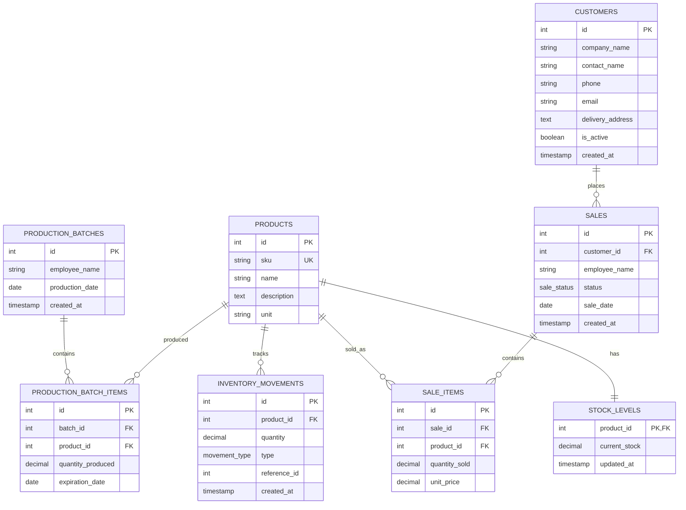

# Bakery Production System ERD

```mermaid
erDiagram

    PRODUCTS {
        int id PK
        string sku UK
        string name
        text description
        string unit
    }

    PRODUCTION_BATCHES {
        int id PK
        string employee_name
        date production_date
        timestamp created_at
    }

    PRODUCTION_BATCH_ITEMS {
        int id PK
        int batch_id FK
        int product_id FK
        decimal quantity_produced
        date expiration_date
    }

    CUSTOMERS {
        int id PK
        string company_name
        string contact_name
        string phone
        string email
        text delivery_address
        boolean is_active
        timestamp created_at
    }

    SALES {
        int id PK
        int customer_id FK
        string employee_name
        sale_status status
        date sale_date
        timestamp created_at
    }

    SALE_ITEMS {
        int id PK
        int sale_id FK
        int product_id FK
        decimal quantity_sold
        decimal unit_price
    }

    INVENTORY_MOVEMENTS {
        int id PK
        int product_id FK
        decimal quantity
        movement_type type
        int reference_id
        timestamp created_at
    }

    STOCK_LEVELS {
        int product_id PK,FK
        decimal current_stock
        timestamp updated_at
    }

    PRODUCTS ||--o{ PRODUCTION_BATCH_ITEMS : produced
    PRODUCTION_BATCHES ||--o{ PRODUCTION_BATCH_ITEMS : contains

    CUSTOMERS ||--o{ SALES : places
    SALES ||--o{ SALE_ITEMS : contains
    PRODUCTS ||--o{ SALE_ITEMS : sold_as

    PRODUCTS ||--o{ INVENTORY_MOVEMENTS : tracks

    PRODUCTS ||--|| STOCK_LEVELS : has
```